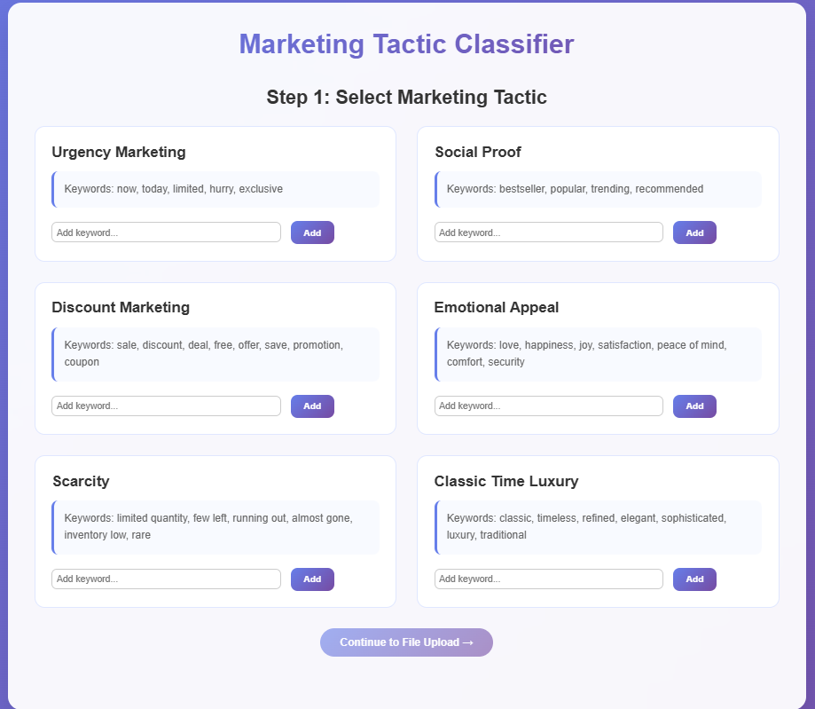
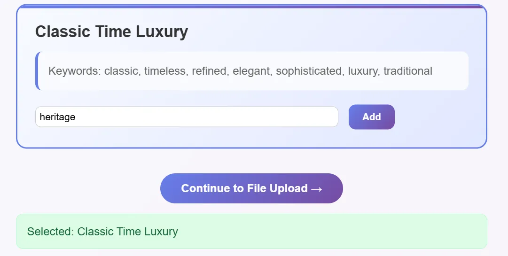
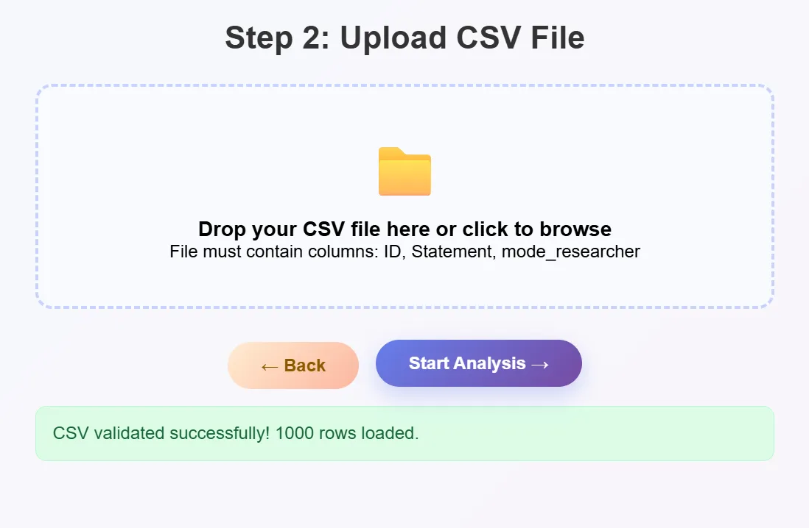
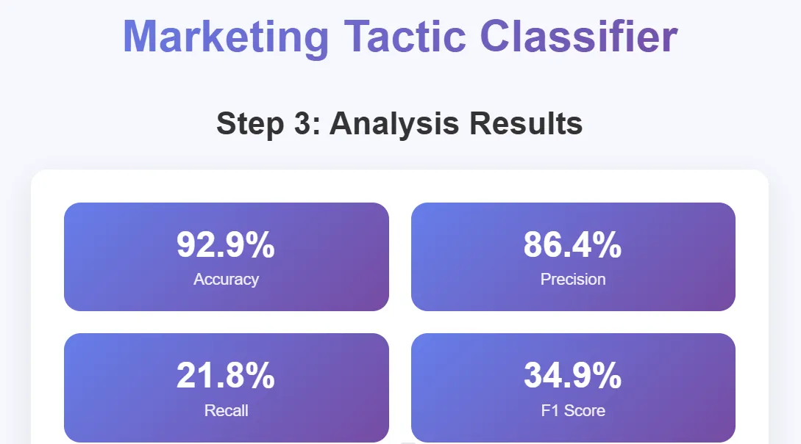

# 📊 GBA6410 Final Project – Dictionary-Based Marketing Tactic Classifier

This is a real-world project built for the course **GBA6410: Social Media Text Mining** at Cal Poly Pomona.  
We developed a dictionary-based classifier to detect marketing tactics — using keyword logic, human-labeled data, and Claude AI for keyword refinement.

## 👤 My Role in the Project

I contributed to the team by:

- Presenting the **Dictionary Classifier app**
- Walking through how tactic-specific keywords were used to label Instagram captions
- Explaining the app’s metrics (accuracy, precision, recall, F1)
- Demonstrating the **Classic Time Luxury** tactic during our final presentation
- Understanding the difference between rule-based and generative AI approaches

This helped me build confidence in explaining AI workflows to a non-technical audience and collaborating with developers.

## 🧠 Problem Statement

How can we automatically detect marketing tactics in Instagram captions?

We explored this by comparing two approaches:
- 🤖 **Generative AI (LLMs like Claude & GPT)**
- 🧾 **Dictionary-based classification** (fast, human-controlled, explainable)

---

## 🧩 Tools & Tech

- ✅ Claude AI (for keyword generation)
- ✅ Custom JavaScript + HTML for the classifier app
- ✅ Sentence-level CSV data
- ✅ Ground truth comparison with precision/recall scoring
- 📄 Notion for project report documentation

---
## 📂 Files in This Repo

| File | Description |
|------|-------------|
| `Classic_Timeless_Luxury_style_round1_groundtruth - ground_truth_mini (2)` | Sample input used in our demo |
| `GBA6410 FINAL PROJECT` | Full project report (Notion export) |
| `README.md` | This project summary you're reading |

> 📎 **Important Note**:  
> GitHub's PDF preview does **not support clickable links**.  
> To access all links in the report, please **download the PDF** and open it in your browser or PDF viewer.

📄 [📥 Download the full report](./GBA6410%20FINAL%20PROJECT.pdf)

---

## 🔗 Key Link from the Report

📝 **Interactive Notion Report**  
[Open in Notion](https://www.notion.so/gAI-Text-Classification-Project-Final-Project-abc123xyz456)

---

## 🎯 Tactic: Classic Timeless Luxury

This tactic reflects high-end brand tone — elegance, heritage, and craftsmanship.

**Keyword examples used**:
timeless, elegant, refined, crafted, signature, bespoke, heritage-crafted, artisanal

---

## 🧪 What the Classifier App Does

| Step | Description |
|------|-------------|
| 1️⃣ | Choose a tactic and define/edit keywords |
| 2️⃣ | Upload a CSV of sentence-level captions |
| 3️⃣ | The app checks each sentence for keyword matches |
| 4️⃣ | Labels sentences as `1` (match) or `0` (no match) |
| 5️⃣ | Compares prediction to human labels and calculates: |
|     | - Accuracy |
|     | - Precision |
|     | - Recall |
|     | - F1 Score |

---

---

## 📸 App Demo – Dictionary Classifier

### Step 1: Select a Marketing Tactic

### Step 2: Upload CSV File

### Step 3: Start Analysis

### Step 4: View Results & Metrics

## 🔍 Results

- 🧠 The dictionary method had **high precision** — great for exact matches
- ⚠️ But it missed more subtle language when the keywords weren't direct
- ✅ This method is explainable and works fast on large datasets
  
